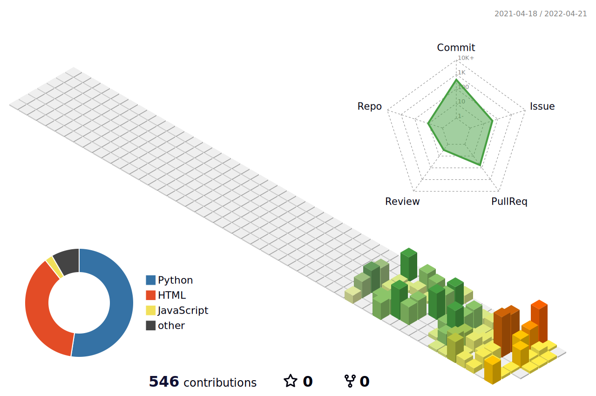

 
  

  
  

  <h3> Hi guys 👋 </h3>  
  Hello I am a new Python developer. 

  

 

  
## ✨  GitHub Stats
  
 
     
    
👩‍💻 Heeseok's Profile Stats 
    
    
    
  

 

 
  
📊 3D Profile Stats

    
  

   

  

 

## Platforms & Languages

   
   
   
  
   
  
  
  
   

  

  
  
  
  

